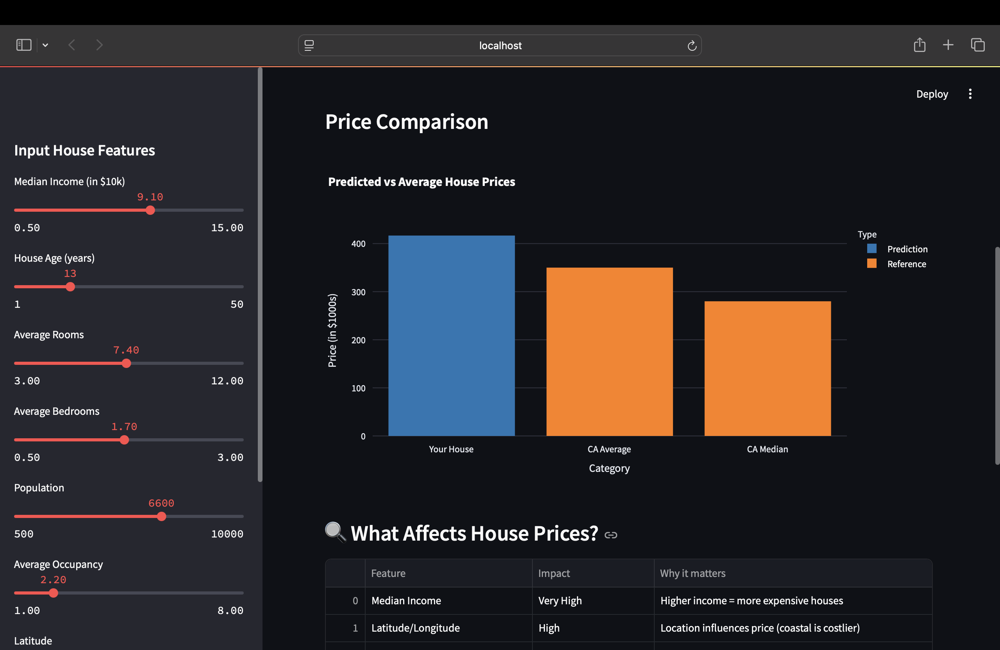
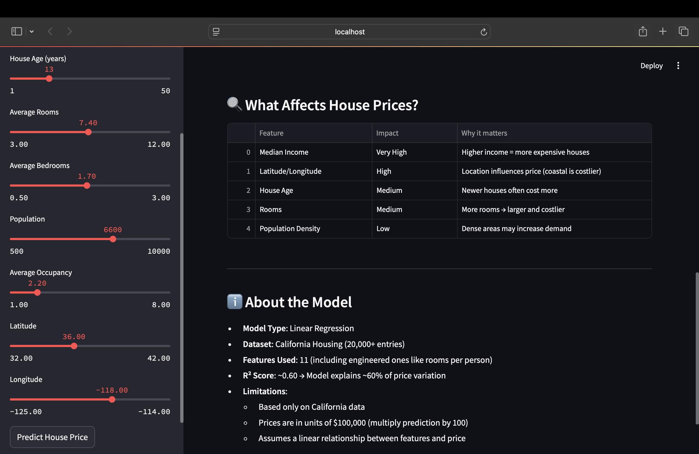

# House Price Prediction - End-to-End ML Project

A complete machine learning project that predicts house prices using Linear Regression. This project demonstrates the full ML pipeline from data preprocessing to model deployment with an interactive web application.

## Project Overview

This project predicts house prices based on features like:
- Median Income in the area
- House Age
- Average number of rooms/bedrooms
- Population and occupancy data
- Geographic location (latitude/longitude)

## Features

- **Complete ML Pipeline**: Data preprocessing, feature engineering, model training, and evaluation
- **Interactive Web App**: User-friendly Streamlit interface for predictions
- **Comprehensive Analysis**: Exploratory data analysis with visualizations
- **Model Interpretability**: Feature importance analysis and model performance metrics
- **Professional Documentation**: Well-documented code and project structure

## Model Performance

- **Algorithm**: Linear Regression
- **R² Score**: ~0.60 (explains 60% of price variance)
- **RMSE**: ~$68k (on California housing data)
- **Features**: 11 features including 3 engineered features

## Tech Stack

- **Python**: Core programming language
- **Scikit-learn**: Machine learning library
- **Streamlit**: Web application framework
- **Pandas & NumPy**: Data manipulation and analysis
- **Matplotlib & Seaborn**: Data visualization
- **Plotly**: Interactive visualizations

##  Screenshots

## Model Details

### Features Used
- **MedInc**: Median income in block group
- **HouseAge**: Median house age in block group
- **AveRooms**: Average number of rooms per household
- **AveBedrms**: Average number of bedrooms per household
- **Population**: Block group population
- **AveOccup**: Average number of household members
- **Latitude**: House block group latitude
- **Longitude**: House block group longitude

### Engineered Features
- **rooms_per_household**: AveRooms / AveOccup
- **population_per_household**: Population density metric
- **bedrooms_per_room**: AveBedrms / AveRooms

### Model Pipeline
1. **Data Loading**: California Housing dataset (20,640 samples)
2. **EDA**: Comprehensive exploratory data analysis
3. **Preprocessing**: Outlier removal, feature scaling
4. **Feature Engineering**: Created 3 new meaningful features
5. **Model Training**: Linear Regression with cross-validation
6. **Evaluation**: Multiple metrics (R², RMSE, MAE)
7. **Deployment**: Interactive Streamlit web application

## Key Insights

- **Median Income** is the strongest predictor of house prices
- **Location** (latitude/longitude) significantly impacts pricing
- **House Age** has a moderate negative correlation with price
- **Engineered features** improve model performance
- Model explains ~60% of price variance in the dataset

## Learning Outcomes

This project demonstrates:
- **End-to-end ML workflow** from data to deployment
- **Feature engineering** and its impact on model performance
- **Model evaluation** using multiple metrics
- **Data visualization** for insights and communication
- **Web application development** with Streamlit

## Acknowledgments

- California Housing dataset from Scikit-learn
- Streamlit team for the amazing framework
- The open-source community for the fantastic libraries

---

⭐ **If you found this project helpful, please give it a star!** ⭐
